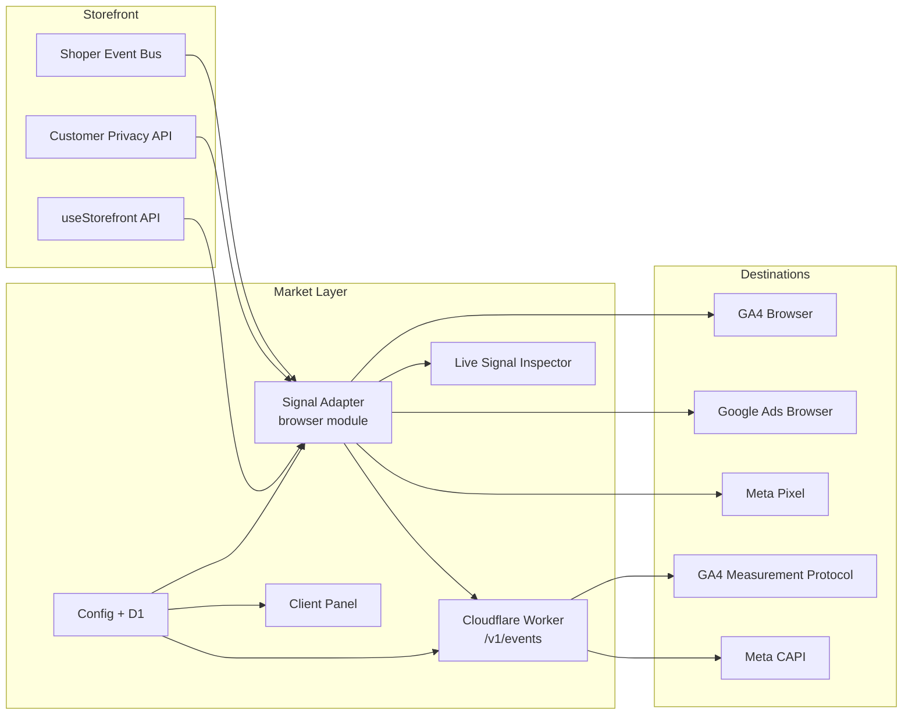

# Market Layer

A consent-aware event infrastructure layer for Shoper storefronts. It normalizes native ecommerce signals, resolves the correct market from hostname and language, and routes events to analytics and advertising platforms with stable event identity and browser/server deduplication.

## Problem

A Shoper store operating across multiple markets, domains, or language versions typically has separate analytics and advertising accounts per market. The native storefront event stream does not distinguish which market an event belongs to. Without an additional layer:

- transactions from different markets can be mixed into a single GA4 property
- event names differ between Shoper, GA4, and Meta
- browser and server deliveries can create duplicates
- consent state from the Shoper Customer Privacy API is not propagated to Google Consent Mode or destination platforms
- there is no stable event identity shared between browser and server delivery

Market Layer sits between the Shoper storefront event bus and destination platforms. It does not replace analytics tools; it normalizes and routes signals so each market receives only its own events in the correct format.

## Architecture

## Event Pipeline

One representative purchase event:

1. **Storefront signal** — Shoper emits `analytics.purchased` with order, basket, and customer data
2. **Capture** — adapter `record()` receives the event from the storefront event bus or message storage
3. **Normalization** — `normalize()` maps the Shoper event to a canonical event name (`order.purchased`) and builds destination-specific payloads (GA4, Google Ads, Meta)
4. **Market resolution** — `resolveRouting()` matches the current hostname and `document.documentElement.lang` against the configured market list; unmatched or ambiguous markets are skipped
5. **Consent** — adapter reads Shoper consent state (`analyticsConsent`, `marketingConsent`) and updates Google Consent Mode; delivery functions gate on consent before sending
6. **Event identity** — `createEventId()` generates a UUID v4 (or timestamp fallback); the same ID is shared between browser Meta Pixel and server Meta CAPI
7. **Destination dispatch** — `sendGa4()`, `sendGoogleAds()`, `sendMetaPixel()` fire browser deliveries; `sendServer()` POSTs a server envelope to the Worker when enabled
8. **Server validation** — Worker validates origin, market, envelope schema, and consent; claims the event in D1 to prevent duplicates
9. **Server delivery** — Worker forwards to GA4 Measurement Protocol and/or Meta CAPI; if delivery fails, the D1 claim is released for retry
10. **Inspector** — Live Signal Inspector polls adapter state every 750ms and renders delivery status, consent, and session journey

## Event Identity and Deduplication

- **event_id** — UUID v4 assigned at normalization time; shared between browser and server Meta delivery
- **transaction_id** — GA4 `transaction_id` and Google Ads `transaction_id` are derived from the Shoper `orderId`
- **Browser deduplication** — GA4 browser delivery maintains an in-memory `sentPurchases` Set to prevent duplicate `purchase` events within a page session
- **Server deduplication** — D1 `event_claims` table stores `marketKey:eventId`; `INSERT OR IGNORE` ensures only the first accepted request delivers; failed deliveries release the claim

## Consent

The adapter integrates with the Shoper Customer Privacy API. Four consent dimensions are tracked:

- `analyticsConsent` — gates GA4 browser and server
- `marketingConsent` — gates Google Ads browser, Meta Pixel browser, and Meta CAPI server
- `functionalConsent`
- `platformAnalyticsConsent`

Google Consent Mode is updated via `crossborderGtag("consent", "update", ...)` whenever Shoper consent changes. The initial page view is captured before consent is known and replayed after consent grant if it was previously blocked.

## Destinations

| Destination | Browser | Server | Notes |
|-------------|---------|--------|-------|
| GA4 | `gtag("event")` via `crossborderGtag` | Measurement Protocol | Server is optional per market |
| Google Ads | `gtag("event", "conversion")` | Not yet implemented | Browser-only conversion tracking |
| Meta Pixel | `fbq("track")` | Conversions API | Server requires encrypted access token |

## Live Signal Inspector

A debug overlay installed in the storefront theme. It reads `window.__crossborderSignalAdapter.inspect()` every 750ms and renders:

- market and routing status
- consent state with Google Consent Mode mapping
- delivery status per destination (GA4, Google Ads, Meta browser/server)
- session journey (up to 50 events desktop, 4 mobile)
- raw JSON state view

No GTM-specific state is currently implemented.

## Technology

- **JavaScript** (ES modules, browser IIFE)
- **Cloudflare Workers** — Worker entry, `/v1/events`, `/v1/config`, `/v1/discovery`
- **Cloudflare D1** — event deduplication, config persistence, discovery state
- **Wrangler** — deployment and secrets management
- **AES-256-GCM** — Meta access token encryption at rest
- **Node.js** — Google Ads Gateway service
- **Google Ads API** — conversion upload validation

## Current Status

Market Layer is under active development. The core browser adapter, Worker gateway, config management, and Live Signal Inspector are implemented and verified. The Google Ads conversion gateway exists as a separate service and has completed remote validate-only verification for PL, DE, and EN markets.

## Repository Scope

This repository contains selected and sanitized parts of the Market Layer implementation intended to demonstrate its architecture and engineering approach. Production configuration, credentials, client-specific data, and private operational tooling are intentionally excluded.
